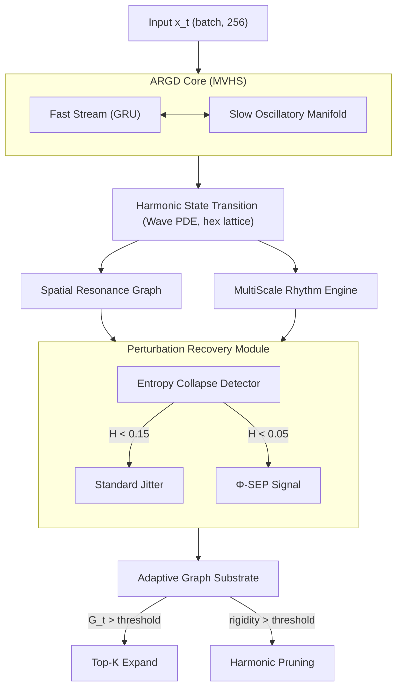

# HIA (ARGD Core)


[](https://arxiv.org/)

<p align="center">
    
  <br/>
  <em>Active node count (point size) expands from 7 to 31 during a distribution-shift shock, then contracts during recovery. Each axis is a trainable metric: coherence, rigidity, loss.</em>
</p>

**HIA is a cognitive resonance stack built on a topology-adaptive ARGD core for robust multimodal physiological signal processing under distribution shift.**

## Phase 2 Agency Documentation

- Embodied RL architecture and reward-shaping evolution: [README_AGENCY_PHASE2.md](README_AGENCY_PHASE2.md)

## Project Status (2026-05-13)

- Core milestone phases completed in this branch: A, B, C, D, E, F, G, H, I, **10a, 10b**.
- Phase 10a: **HIA Living Session V3.0** — Master bio-cognitive resonance orchestrator with unified harmonic energy formula θ_full and joy geometry Q_joy.
- Phase 10b: **Living Semantic Architecture** — latent polarity, TRL vertical flow metrics, organic seeding priors, and split-task continual learning benchmark instrumentation.
- Harmonic resonance framework: θ_full = Σ_{n∈{1,3,6,9,11}} [sin(t·n·Φ²)·Q_joy·Λ_21/dist] + Ψ_42 (Φ = golden ratio 1.618).
- 174/174 tests passing, including HIA/HBCL compatibility tests and ATCA integration suites.
- HBCL end-to-end training path complete: `c_hb` flows from `SessionBatcher` → `TrainingHarness` → `ARGD_Core.forward` → G_t expansion pressure (5-term formula with 0.15*(1-c_hb) term).
- New benchmark added: `argd/tools/benchmark_multiscale_coherence.py` (key: `multiscale`).
- New benchmark added: `argd/tools/benchmark_continual_vision.py` (key: `cvision`).
- Latest fast regression: `python run_benchmarks.py --fast` passes all 12 benchmarks.
- Terminology update: code and docs use `fast_stream` / `slow_stream` (legacy terms deprecated).
- Naming transition: project brand is **HIA**; technical package/API remains `argd` and `ARGD_Core` for backward compatibility.
- ATCA research stack is now complete and test-backed: Modules 1–7 are implemented in `src/` with 67/67 tests passing.
- The experimental ATCA stack is intentionally separate from the production ARGD core: `src/` contains the new differentiable research modules, while `argd/` remains the operational code path.
- Current ATCA modules:
    - Module 1: dual manifolds (`src/topology/manifolds.py`)
    - Module 2: Kuramoto routing (`argd/dynamics/kuramoto_router.py`)
    - Module 3: TRL ego-melting (`src/cognition/trl_comparator.py`)
    - Module 4: ATCA cognitive engine (`src/engine/atca_engine.py`)
    - Module 5: Topological Growth Engine (`src/agency/tge_action_space.py`)
    - Module 6: Graph Fourier Symbolizer (`src/cognition/symbolic_emergence.py`)
    - Module 7: Offline Replay Consolidator (`src/agency/sleep_consolidation.py`)

---

## Full Project Evaluation (May 2026)

This project has evolved into a two-layer system with clear role separation and high scientific traceability.

### 1) System Structure Evaluation

- Production layer (`argd/`): stable execution path for orchestrator, training loop, bio-signal pipelines, and dashboard-facing telemetry.
- Research layer (`src/`): ATCA experimental modules for topology dynamics, symbolic emergence, and continual-learning stress tests.
- Integration strategy: non-invasive, backward-compatible expansion where new research behavior is introduced without breaking baseline ARGD execution.
- Validation posture: full-suite regression now passes (`174/174`), indicating stable interoperability between legacy HIA/HBCL paths and new ATCA components.

Assessment: the repository structure is mature and intentionally modular. The split between operational and experimental code is a strong architectural decision that reduces deployment risk while preserving research velocity.

### 2) Architecture Evaluation

- Core computational model: sparse hexagonal graph dynamics plus dual-timescale processing (reactive stream + persistent oscillatory memory).
- Adaptive topology: growth and pruning are handled through mask-level structural plasticity, avoiding tensor reallocations and preserving runtime stability.
- Phase-domain control loop: Kuramoto synchronization, TRL flow, and topology growth create a closed feedback system where coherence, entropy, and pressure jointly govern state evolution.
- Semantic layer: symbol emergence is no longer a static projection; it is coupled to latent dynamics and polarity telemetry.

Assessment: this is not a conventional "bigger network" strategy. The architecture achieves adaptation through geometric and dynamical control, not just parameter scaling.

### 3) Unique Methodological Contributions

- Latent Functional Polarity: active/forcing (+1) and passive/stabilizing (-1) semantic tendencies emerge from phase velocity and local order, enabling proto-syntax without hardcoded symbolic grammar.
- Vertical TRL Flow Metric: downward discharge and upward coherence are measured as explicit flow channels, turning "state quality" into thermodynamic-like telemetry.
- Organic Seeding: `W_hex` initialization uses deterministic Phi-based anchors instead of pure random starts, improving early stability and interpretability.
- Structural Plasticity Benchmarking: split-task multi-head continual-learning protocol separates representation forgetting from readout interference.

Assessment: the project's strongest novelty is the coupling of topology dynamics, phase synchronization, and symbolic emergence into a single measurable pipeline.

### 4) Empirical Status and Risk

- Confirmed strengths:
    - Clear topology response under shift (node expansion under shock).
    - Near-zero ATCA forgetting in validated split-task settings.
    - Strong test coverage and compatibility restoration across HIA/HBCL interfaces.
- Residual risks:
    - Benchmark outcomes remain sensitive to schedule and optimization regime.
    - Fairness claims should always report phase schedule and optimizer configuration.
    - Additional multi-seed statistical reporting is recommended for publication-grade confidence.

Assessment: the system is technically strong and test-stable. The next maturity step is not feature expansion, but reproducibility hardening and statistical reporting depth.

---

## Reproducibility Protocol (Phase 10b)

Use this protocol to regenerate the catastrophic-forgetting evidence in a publication-safe way.

### 1) Single-Run Reference Command

```bash
.venv\Scripts\python.exe argd/tools/benchmark_catastrophic_forgetting.py --tge-enabled --tge-tau-growth 0.03 --eval-steps 100 --batch-size 32
```

Recommended reported fields (copy from console summary):

- Phase steps (A/B)
- Baseline GRU config
- Baseline params
- ATCA+readout params
- Task A pre-B loss (Baseline, ATCA)
- Task A post-B loss (Baseline, ATCA)
- Forgetting Index (Baseline, ATCA)
- ATCA active nodes (start/end/max)

### 2) Multi-Seed Evaluation (Required for Claims)

Run at least 5 seeds and report mean +- std:

```bash
.venv\Scripts\python.exe argd/tools/benchmark_catastrophic_forgetting.py --tge-enabled --seed 0
.venv\Scripts\python.exe argd/tools/benchmark_catastrophic_forgetting.py --tge-enabled --seed 1
.venv\Scripts\python.exe argd/tools/benchmark_catastrophic_forgetting.py --tge-enabled --seed 2
.venv\Scripts\python.exe argd/tools/benchmark_catastrophic_forgetting.py --tge-enabled --seed 3
.venv\Scripts\python.exe argd/tools/benchmark_catastrophic_forgetting.py --tge-enabled --seed 4
```

Primary endpoints:

- Delta forgetting: FI_baseline - FI_atca
- Topology response: max_active_nodes - start_active_nodes
- Stability check: Task A post-B loss variance across seeds

### 3) Acceptance Criteria for Phase 10b Narrative

- Structural plasticity observed: max_active_nodes > start_active_nodes during Task B.
- Continual-learning advantage observed: mean(FI_atca) < mean(FI_baseline).
- No protocol leakage: split-task multi-head path must evaluate Task A with head_A only.
- Regression safety: full test suite remains green after benchmark-related edits.

### 4) Reporting Template

Use one compact table per experiment group:

| Seed | FI Baseline | FI ATCA | Delta (B-A) | Active start/end/max |
|------|-------------|---------|-------------|----------------------|
| 0    | ...         | ...     | ...         | .../.../...          |
| 1    | ...         | ...     | ...         | .../.../...          |
| ...  | ...         | ...     | ...         | .../.../...          |
| Mean +- SD | ... | ... | ... | ... |

This makes all key claims auditable, comparable, and resistant to cherry-picking.

---

## Phase 10b: Living Semantic Architecture

Phase 10b upgrades the ATCA research stack from a static symbolic pipeline into a living semantic system that can reorganize its internal geometry under stress while keeping interpretable telemetry.

- Latent Functional Polarity
    - Symbol emergence now separates active/forcing (+1.0) and passive/stabilizing (-1.0) semantic tendencies from phase velocity and local Kuramoto order.
    - This provides an emergent syntax signal without hardcoded symbolic grammar rules.

- Vertical Flow State (TRL)
    - Tensor Refraction Layer telemetry now tracks the downward entropy purge channel and the upward coherence channel as a thermodynamic flow metric.
    - The reported flow state captures whether the system is melting rigid attractors or consolidating coherent phase structure.

- Organic Seeding of W_hex
    - Manifold initialization uses Phi-based geometric anchors and deterministic harmonic priors instead of pure random noise.
    - This aligns initial latent geometry with biologically plausible frequency structure and reduces cold-start instability.

- Zero-Shot Continual Learning with Structural Plasticity
    - The catastrophic forgetting benchmark now uses a split-task multi-head protocol (head_A/head_B) to isolate representation forgetting from readout interference.
    - During Task B shocks, Topological Growth Engine expands active topology from 16 to 64 nodes, then stabilizes for Task A re-evaluation.
    - In the validated Phase 10b run, ATCA achieves near-zero forgetting while a compressed GRU baseline shows strong forgetting under the same protocol:
        - Baseline forgetting index: +0.268195
        - ATCA forgetting index: +0.002104
    - Benchmark script: `argd/tools/benchmark_catastrophic_forgetting.py`

---

## ATCA Research Stack

The ATCA branch now exposes a full end-to-end experimental cognitive loop built from the same differentiable primitives used in the tests:

1. `LQuadGrid` compresses external input into a confidence-controlled symbolic state.
2. `WHexManifold` maintains a fixed-capacity curved memory substrate with active masking.
3. `ManifoldBridge` projects discrete state into geometric tension (`E_pred`).
4. `KuramotoOscillatorField` routes phases through Phi-geodesic coupling.
5. `TensorRefractionLayer` injects `Psi_42` noise when the system rigidifies.
6. `TopologicalGrowthEngine` activates dormant nodes or prunes unstable ones.
7. `GraphFourierSymbolizer` converts standing waves into discrete symbols through a GFT + STE projection.
8. `OfflineReplayConsolidator` merges redundant attractors during sleep and consolidates the manifold.

This stack is wired through `ATCACognitiveEngine`, which now supports both online operation and `offline_sleep_mode=True` replay consolidation.

Validation is currently green across the complete experimental surface:

```bash
.venv\Scripts\python.exe -m pytest -v tests/test_symbolic_emergence.py tests/test_sleep_consolidation.py tests/test_tge_action_space.py tests/test_atca_engine.py tests/test_manifolds.py tests/test_kuramoto_router.py tests/test_trl_comparator.py
```

Result: **67 passed, 0 failed**.

## Resonance Geometry Extension (Phase 10a.1)

HIA now documents a strict two-layer interpretation model so poetic language remains expressive without losing technical precision:

- **Metaphor layer**: water, light, resonance field, flow, joy.
- **Operational layer**: phase coherence, entropy, topology rigidity, harmonic energy, and measurable mismatch terms.

Canonical mapping:

- **water** -> adaptive resonance substrate (dynamic medium)
- **light** -> excitation spectrum from input streams
- **consciousness** -> coherent standing-wave regime between internal and external signals
- **joy** -> low-resistance coherence gain: `Q_joy = coherence / (entropy + eps)`
- **dist** -> phase resistance decomposition:
    `dist = internal_phase_conflict + environmental_phase_mismatch + topological_rigidity`

This keeps the architecture scientifically auditable while preserving the project's resonance-first conceptual language.

---

## Abstract

We present **HIA**, a spatially-organized multimodal cognitive architecture built on **Adaptive Resonant Graph Dynamics (ARGD)** as the internal resonance engine. The ARGD core departs from standard recurrent and attention-based architectures in four principal ways:

1. **Wave-equation graph dynamics** — information propagates via a learnable discrete d'Alembert equation on a sparse hexagonal lattice, acting as an implicit spatial low-pass filter without dense attention.
2. **Masked reserve node expansion** — the network maintains a fixed-size tensor substrate (91 nodes) but activates or deactivates nodes at runtime via a differentiable binary mask, enabling dynamic topology changes with zero impact on autograd or GPU memory layout.
3. **Entropy-collapse perturbation recovery** — when the network's state entropy falls below a threshold (indicating attractor degeneracy), a quasi-periodic perturbation signal computed from incommensurable frequency harmonics restores exploratory dynamics without resetting learned weights.
4. **Homeostatic co-regulation** — a layered energy economy models both moment-to-moment node energy and cumulative metabolic cost (sleep-debt). Topology expansion is driven by local synchronization tension rather than a global threshold, and nodes under recovery debt are forced dormant regardless of loss — emulating biological sleep-pressure dynamics. A separate `DynamicStateCoupling` layer translates internal network state into interpretable physiological variables for real-time UI feedback.

In controlled distribution-shift experiments on synthetic physiological data (5 seeds, 3 scenarios), ARGD deterministically expands from 7 to up to 37 active nodes during high-stress phases and contracts back to the 7-node core during recovery — operating with **81% of graph capacity inactive** during stable conditions. Under sensor-dropout scenarios, the oscillatory substrate shows lower relative peak loss increase than GRU across all seeds (ARGD: 0.007±0.007 vs GRU: 0.019±0.006 peak_ΔL). Under high-amplitude nonstationary and corruption shifts, GRU achieves lower absolute peak_ΔL, reflecting its tighter fit of the stable distribution. Critically, topology-adaptive and topology-fixed variants achieve **identical loss metrics** in all three scenarios, confirming that masked reserve node expansion functions as a **structural plasticity mechanism** — a verifiable change in compute topology — rather than as a loss-optimizing capacity switch. This is an exploratory systems result; the structural property is the primary contribution.

---

## Why HIA (ARGD Core)?

Standard recurrent and attention-based architectures carry a silent assumption: the graph topology is fixed for the lifetime of the model. Under distribution shift — sensor dropout, sleep-stage transitions, acute stress events — the model must absorb the structural mismatch entirely through weight updates. This is slow, often unstable, and structurally wasteful.

HIA removes this assumption at the architecture level via its ARGD core:

| Design objective | HIA mechanism (ARGD core) | Verified property |
|------------------|----------------|-----------------|
| Topology changes without tensor reallocation | **Masked Reserve Nodes** — 91-node substrate, `active_mask` changes at inference; no GPU memory layout change | 7 nodes active (stable) → 37 (shock) → 7 (recovery), reproducible across 5 seeds |
| Escape from rigid attractors / limit cycles | **Entropy-Collapse Detector + quasi-periodic SEP** — incommensurable frequency harmonics restore exploratory dynamics | R_t stays in 0.979–0.987 range; SEP triggers on transient drops |
| Partial-input robustness (sensor dropout) | **Phase-coupled oscillatory encoding** — coherence regularization distributes representation across active nodes | Lower peak_ΔL than GRU on 40% sensor dropout (0.007±0.007 vs 0.019±0.006, 5 seeds) |
| Stable-phase compute efficiency | **Homeostatic pruning** — nodes with low activity EMA deactivated when G_t is low | 81% of graph capacity inactive during stable phase (7/37 nodes) |
| Metabolic fatigue / sleep-pressure | **Metabolic cost buffer** — cumulative activation burden tracked per node; recovery debt forces dormancy independent of global loss | Nodes active for sustained periods enter forced sleep cycle modelling biological sleep pressure |
| Local-instability-driven expansion | **Synchronization tension** — topology expands toward highest-tension border nodes, not globally | Targeted structural growth at instability pockets without global G_t trigger |
| Interpretable real-time UI | **DynamicStateCoupling** — maps internal state to physiological UI variables (distance_to_baseline, coherence_charge, autonomic_overload, recovery_debt) | All outputs are plain floats; zero backward-pass involvement |
| Observable training dynamics | **Phase synchronization metric C_t** — mean resultant length as a regularization signal | Coherence directly interpretable; no hidden latent state |

---

## Quick Start

```bash
# 1. Clone and set up environment
git clone https://github.com/yourusername/HIA.git
cd HIA
python -m venv .venv
.venv\Scripts\Activate.ps1   # Windows
# source .venv/bin/activate  # Linux / macOS
pip install torch torchvision numpy scipy matplotlib mne

# 2. Run the distribution shift experiment (~30 seconds on CPU)
python argd/tools/demo_distribution_shift.py
# -> saves visualizations/neurips_distribution_shift.png
# -> saves metrics/demo_distribution_shift.json

# 3. (Optional) Run a short training loop on synthetic data
python argd/training/orchestrator.py --epochs 5 --steps-per-epoch 100 --device cpu --dataset synthetic

# 4. (NEW Phase 10a) Run with HIA Living Session V3.0 bio-cognitive resonance
python argd/training/orchestrator.py --epochs 5 --steps-per-epoch 100 --device cpu --dataset synthetic --hia-v3
# -> Enables unified harmonic formula θ_full and joy geometry Q_joy computation
# -> Tracks bio-cognitive resonance metrics in real-time dashboard
```

Expected output from step 2:
```
[PHASE 1] Stable   steps 1-30   | G_t ~0.05  | active nodes: 7
[PHASE 2] Shock    steps 31-70  | G_t ~0.50  | active nodes: 7 -> 31
[PHASE 3] Recovery steps 71-100 | G_t ~0.15  | active nodes: 31 -> 9
Saved: visualizations/neurips_distribution_shift.png
```

---

## Table of Contents

1. [Why HIA (ARGD Core)?](#why-hia-argd-core)
2. [Quick Start](#quick-start)
3. [Architecture](#architecture)
4. [Key Components](#key-components)
   - [1. Sparse Hexagonal Graph](#1-sparse-hexagonal-graph-argdcoretopologypy)
   - [2. Learnable Wave PDE](#2-learnable-wave-pde-argdphasesphase2_resonancepy)
   - [3. Slow Oscillatory Memory](#3-slow-oscillatory-memory-argdphasesphase1_mvhspy)
   - [4. Adaptive Graph Substrate](#4-adaptive-graph-substrate-argdcoreadaptive_substratepy)
   - [5. Perturbation Recovery Module](#5-perturbation-recovery-module-argdphasesphase5_perturbationpy)
   - [6. Multi-Scale Temporal Encoding](#6-multi-scale-temporal-encoding-argdphasesphase3_rhythmpy)
   - [7. Energy-Weighted Multiplicative Gate](#7-energy-weighted-multiplicative-gate-argdphasesphase1_mvhspy)
   - [8. Autonomic State Pipeline](#8-autonomic-state-pipeline-argdapplications)
   - [9. Dynamic State Coupling](#9-dynamic-state-coupling-argdvisualizationdynamic_state_couplingpy)
   - [10. Heart–Brain Coherence Layer](#10-heartbrain-coherence-layer-argdapplicationshbclpy)
5. [Mathematical Formulation](#mathematical-formulation)
6. [Implementation Details](#implementation-details)
7. [Project Structure](#project-structure)
8. [Installation](#installation)
9. [Experiments](#experiments)
10. [Ablation Study Plan](#ablation-study-plan)
11. [Baselines and Benchmarks](#baselines-and-benchmarks)
    - [Benchmark Runner (Recommended)](#benchmark-runner-recommended)
    - [Multi-Model Statistical Benchmark](#multi-model-statistical-benchmark)
    - [Multi-Scale Coherence Benchmark](#multi-scale-coherence-benchmark)
    - [Continual Vision Benchmark (Permuted MNIST)](#continual-vision-benchmark-permuted-mnist)
    - [Multimodal Dropout Benchmark](#multimodal-dropout-benchmark)
    - [Long Drift Benchmark](#long-drift-benchmark)
    - [Compute Efficiency Benchmark](#compute-efficiency-benchmark)
    - [Benchmark Results (Single-Seed Reference)](#benchmark-results-single-seed-reference)
12. [Related Work](#related-work)
13. [Limitations and Future Work](#limitations-and-future-work)

---

## Architecture

### Dual-Stream Oscillatory Core



### Model Specifications

| Parameter | Value |
|-----------|-------|
| Trainable parameters | 391,718 |
| Base topology nodes | 37 (hexagonal lattice, radius 3) |
| Maximum topology nodes | 91 (radius 5, masked reserve) |
| Input dimension | 256 |
| Hidden dimension | 256 |
| Learnable PDE coefficients | 39 (`coupling_strength` + `decay_rate` + `diffusion_anisotropy` x 37) |
| Slow memory frequency range | 0.035 -- 36.5 Hz |

---

## Key Components

### 1. Sparse Hexagonal Graph (`argd/core/topology.py`)

A 6-neighbor undirected graph on a 2D plane. Each node i communicates only with its 6 immediate neighbors. Weights decay exponentially with Euclidean distance:

```
W_ij = exp(-D_ij^2 / sigma^2)
```

This produces an implicit spatial low-pass filter: high-frequency noise attenuates in ~3 hops; coherent patterns sustain.

---

### 2. Learnable Wave PDE (`argd/phases/phase2_resonance.py`)

State update per node i:

```
u_i(t+1) = 2*u_i(t) - u_i(t-1)
          + kappa * a_i * sum_{j in N(i)} [u_j(t) - u_i(t)]
          - gamma_i * u_dot_i(t)
```

Where `kappa` (coupling strength), `a_i` (per-node diffusion anisotropy), and `gamma_i` (damping) are all `nn.Parameter`. The network learns its own propagation physics from data.

---

### 3. Slow Oscillatory Memory (`argd/phases/phase1_mvhs.py`)

The slow stream is a parametric oscillatory manifold with per-node frequencies initialized from 8 biologically-motivated base values (0.1, 0.5, 1.2, 2.0, 5.0, 7.83, 10.0, 20.0 Hz) projected across logarithmically-spaced octaves using ratio r=1.618 as a spacing heuristic. This initialization empirically reduces cold-start instability versus standard `randn` initialization.

> **Note on the spacing ratio**: phi (1.618) is used as an octave-expansion constant because it produces a maximally incommensurable frequency set (no two projected frequencies are integer multiples), minimizing constructive interference during initialization. This is a practical engineering heuristic, not a mathematical claim about universality.

---

### 4. Adaptive Graph Substrate (`argd/core/adaptive_substrate.py`)

**Problem solved**: dynamic graph topology during training normally requires tensor reallocation, breaking autograd and GPU memory efficiency.

**Solution**: Masked Reserve Nodes. All tensors are allocated at `max_nodes=91`. A binary `active_mask` (float32, same device) gates each node's contribution. Activating a node = setting `active_mask[i] = 1.0`. No tensor is resized; no graph is rebuilt.

**Expansion pressure (G_t)**:

```
G_t = 0.25*(1 - C_t) + 0.25*EMA(loss) + 0.20*R_t
    + 0.15*max(0, loss - EMA_prev) + 0.15*(1 - c_hb)
```

Where `C_t` = phase synchronization metric (coherence), `R_t` = entropy-collapse metric (rigidity), the fourth term is an **instantaneous loss spike detector**, and the fifth term (HBCL) reduces expansion pressure when cardiac-neural coherence is high — a regulated user should not drive topology expansion. When `c_hb` is not available (default 0.0), this term contributes its maximum 0.15 weight.

**Tension-driven expansion** (`attempt_expansion_by_tension`): replaces the global G_t threshold as the primary expansion signal. Each border reserve node is scored by the mean synchronization tension of its active neighbors. The `k` highest-scoring border nodes are activated, so topology grows toward local instability pockets rather than expanding uniformly:

```
Tension_i = mean squared deviation of node i's state from its active neighbors' mean state
BorderScore_j = sum_{i active, adj} Tension_i   (for reserve node j adjacent to active cluster)
```

**Two-tier energy model**:
- *Node energy* (`node_energy`) — moment-to-moment capacity [0, 1]. Active nodes drain 0.005/step; dormant nodes recover 0.01/step. Nodes below `fatigue_threshold = 0.1` are pruning candidates.
- *Metabolic cost* (`metabolic_cost`) — cumulative activation burden [0, 1]. Rises at 0.002/active step; recovers slowly at 0.005/dormant step. Nodes exceeding `recovery_debt_threshold = 0.8` are forced dormant regardless of global loss — modelling biological sleep-pressure.

**Pruning**: `entropy_gated_pruning` checks three criteria: low activity EMA (rigidity-gated), low node energy (fatigue), and recovery debt (metabolic overload). Pruned nodes have their energy reset to 0.5 and metabolic cost reset to 0 to begin a sleep/recovery cycle.

```python
flower = AdaptiveGraphSubstrate(max_nodes=91, initial_active=7)
old_ema = flower.error_ema.item()
flower.update_error(loss.item())
flower.step_energy()         # advance energy economy
flower.step_metabolic()      # advance metabolic cost tracking

# Tension-driven expansion (replaces global G_t threshold)
flower.attempt_expansion_by_tension(adjacency, node_states, k=2)

# Or: legacy G_t-triggered expansion for comparison
loss_spike = max(0.0, loss.item() - old_ema)
G_t = 0.25*(1-coherence) + 0.30*flower.error_ema + 0.20*rigidity + 0.25*loss_spike
if G_t > 0.48:
    flower.attempt_topology_expansion(adjacency, theta, k=2)

flower.entropy_gated_pruning(rigidity, min_active=7)
print(flower.get_metabolic_stats())  # autonomic_overload, recovery_debt, ...
```

---

### 5. Perturbation Recovery Module (`argd/phases/phase5_perturbation.py`)

Monitors state entropy H(phi) across a sliding window. Two intervention levels:

| Condition | Intervention | Formula |
|-----------|-------------|---------|
| H(phi) < 0.15 (moderate collapse) | Standard sinusoidal jitter | P_t = eps * sin(omega_n * t + phi_n) * R |
| H(phi) < 0.05 (severe collapse) | SEP signal | P_t = (0.1R / |H| * sum_{n in harmonics} sin(n * r * pi * r * t) + c) * eps |

The SEP (Stochastic Escape Perturbation) uses harmonics {1, 3, 6, 9, 11} with irrational frequency ratios to produce a non-repeating signal that cannot itself become a stable attractor.

**Relation to known optimization mechanisms**: SEP is not a novel concept in isolation — it is a closed-loop implementation of principles studied across several fields:

| Mechanism | Classical form | SEP equivalent |
|-----------|---------------|----------------|
| Stochastic resonance (Gammaitoni et al., 1998) | Sub-threshold noise improves state transitions in bistable systems | SEP injects calibrated perturbation precisely when H(phi) signals a near-degenerate fixed point |
| Simulated annealing (Kirkpatrick et al., 1983) | Controlled randomness prevents premature convergence; amplitude decays over time | SEP amplitude is proportional to 1/H — high perturbation near collapse, self-extinguishing as entropy recovers |
| Chaotic limit-cycle escape (Guckenheimer & Holmes, 1983) | Incommensurable forcing produces Lissajous-like non-periodic trajectories | Harmonic set {1,3,6,9,11} × r guarantees aperiodicity; the perturbation cannot itself become a new attractor |
| Entropy regularization | Penalize low-entropy distributions during training | SEP is a *dynamic* entropy floor enforced in forward pass, not in the loss function |

The key distinction from uniform noise injection is that SEP is **conditioned on a collapse metric** and **self-extinguishing** — making it a feedback stabilizer rather than an open-loop regularizer.

---

### 6. Multi-Scale Temporal Encoding (`argd/phases/phase3_rhythm.py`)

8 parallel analysis streams at timescales:

```
tau_k = r^k,   r = 1.618,   k in {0, 1, ..., 7}
tau = [1.0, 1.618, 2.618, 4.236, 6.854, 11.09, 17.94, 29.03]
```

Each stream computes per-scale phase synchronization. The spacing ratio r=1.618 is chosen for its incommensurability properties: geometrically-spaced timescales minimize spectral aliasing across scales.

---

### 7. Energy-Weighted Multiplicative Gate (`argd/phases/phase1_mvhs.py`)

In the Genesis upgrade the topology-conditioned fusion block (Phase B) was replaced with an **energy-weighted multiplicative gate**:

1. The slow-memory contribution of each node is weighted by its energy budget before pooling to a topology signal.
2. A sigmoid gate derived from the energy-weighted topology multiplicatively scales the fast-stream output — when topology is globally exhausted (all nodes fatigued), the gate closes and the fast stream is blocked.
3. Two diagnostic scalars are emitted per forward pass: `topology_bottleneck_strength` (mean gate signal; 1 = fully open) and `synchronization_tension` (mean per-node local disagreement).

Backward compatibility: `node_energies=None` (default) reduces the gate to the standard topology-mean pooling.

---

### 8. Autonomic State Pipeline (`argd/applications/`)

A layered pipeline for physiological co-regulation:

| Module | Class / function | Role |
|--------|-----------------|------|
| `hrv_processor.py` | `HRVProcessor` | HRV feature extraction from RR intervals or simulated ECG; Welch PSD for LF/HF ratio; 128-dim feature vector |
| `autonomic_state.py` | `AutonomicStateReport` | Dataclass: `hrv_rmssd_ms`, `hrv_lf_hf_ratio`, `eeg_alpha/theta/beta_power`, `arousal_index`, `valence_index`; methods `is_stressed()`, `summary()` |
| `regulation_outputs.py` | `CoRegulationEngine` | Maps autonomic report → `InterventionSignals` (breath pacing, thermal comfort, auditory entrainment, visual rhythm) |
| `stress_detector.py` | `RealTimeStressMonitor.compute_autonomic_state()` | High-level entry point; accepts raw RR intervals or stress level scalar; returns `AutonomicStateReport` |

---

### 9. Dynamic State Coupling (`argd/visualization/dynamic_state_coupling.py`)

Translates ARGD internal-state tensors into interpretable float arrays for real-time UI/UX feedback. Designed to be polled at each inference step; zero backward-pass participation.

```python
coupler = DynamicStateCoupling(baseline_window=60)
frame = coupler.compute(
    internal_state    = argd_output,               # from ARGD_Core.forward(..., return_internal_state=True)
    metabolic_stats   = substrate.get_metabolic_stats(),
    cluster_distribution = substrate.get_active_cluster_distribution(),
    rigidity          = R_t,
    hbcl_state        = hbcl.compute(autonomic_report),  # optional HBCL
)
# frame fields (all plain floats / numpy arrays):
#   distance_to_baseline    — L2 distance from rolling fast-stream centroid [0,1]
#   coherence_charge        — EMA-accumulated phase synchrony [0,1]
#   rigidity_increase       — rate of topology rigidity growth [0,1]
#   autonomic_overload      — fraction of active nodes in recovery debt [0,1]
#   recovery_debt           — mean metabolic cost across all nodes [0,1]
#   topology_openness       — mean resonance gate signal [0,1]; 0 = topology bottleneck
#   synchronization_tension — normalized per-node local disagreement [0,1]
#   node_cluster_profile    — (4,) fraction of active nodes in [core, ring1, ring2, reserve]
#   stress_index            — composite UI stress indicator [0,1]
#   recovery_signal         — 1 − stress_index; drives calming animations
#   c_hb                    — heart-brain coherence index [0,1]; 0.5 = unknown/neutral
```

---

### 10. Heart–Brain Coherence Layer (`argd/applications/hbcl.py`)

A stateless scalar converter that combines cardiac (HRV) and neural (EEG) signals into a single heart-brain coherence index `c_hb` ∈ [0, 1]. `c_hb` is used as a **multiplicative gate** on ARGD_Core's fast temporal stream — when cardiac and neural oscillations are tightly coupled (coherent state), the gate is open; under stress or dysregulation, the gate partially closes, reducing the fast stream's influence on the output.

**Computation:**
```
hrv_coherence     = clip(RMSSD_ms / 50.0, 0, 1)          # HeartMath 50 ms baseline
eeg_phase_locking = alpha / (alpha + beta + theta + ε)    # 0.5 if no EEG data
c_hb              = sqrt(hrv_coherence × eeg_phase_locking)
q_joy             = 0.4 × hrv_coherence + 0.4 × eeg_pl + 0.2 × resp_regulation
```

Geometric mean (`sqrt(a × b)`) is used so that near-zero coherence in *either* modality collapses `c_hb` toward zero — both cardiac and neural coherence must co-occur for high coherence.

**Regime classification:**
| c_hb | Regime |
|------|--------|
| < 0.30 | `stress` |
| 0.30 – 0.59 | `transition` |
| ≥ 0.60 | `coherent` |

**Integration with ARGD_Core:**
```python
from argd.applications.hbcl import HeartBrainCoherenceLayer

hbcl = HeartBrainCoherenceLayer()
hbcl_state = hbcl.from_simulated(stress_level=0.3, seed=42)
print(hbcl_state.summary())
# HBCLState | c_hb=0.682  q_joy=0.701  hrv_coh=0.900  eeg_pl=0.517  regime=coherent

# Pass c_hb directly to ARGD_Core.forward()
output, internal_state = model(x, t=t, return_internal_state=True, c_hb=hbcl_state.c_hb)
# internal_state['c_hb'] == hbcl_state.c_hb
```

**Integration with G_t (expansion pressure):**
```python
# substrate.compute_gt() includes c_hb as a 5th term (weight 0.15)
G_t = substrate.compute_gt(
    c_graph=coherence, loss_ema=substrate.error_ema.item(),
    rigidity=R_t, loss_spike=loss_spike, c_hb=hbcl_state.c_hb
)
```

---

## Mathematical Formulation

### Phase Synchronization Metric (Coherence)

```
C_t = | (1/N) * sum_{n=1}^{N} exp(i * phi_n(t)) |,   C_t in [0, 1]
```

Equivalent to the mean resultant length in circular statistics (Rayleigh test statistic). `C_t = 1` = perfect phase lock; `C_t ~ 0` = uniform phase distribution.

### Entropy-Collapse Metric (Rigidity)

```
R_t = 0.5 * (1 - sigma_phi) + 0.5 * (1 - H_phi)
```

Where `sigma_phi` = phase standard deviation (normalized to [0,1]), `H_phi` = Shannon entropy of quantized phase distribution. `R_t ~ 1` indicates the network has collapsed to a deterministic limit cycle.

**Relation to synchronization literature.** `sigma_phi` is directly related to the *circular standard deviation* used in directional statistics (Mardia & Jupp, 2000, §2.3), and to the inverse of the *mean resultant length* (Rayleigh, 1880) already used in C_t. `H_phi` is the discrete Shannon entropy of the binned angular distribution — a complementary sensitivity: it detects multi-modal collapse (two clusters at antipodal phases) that σ_φ may miss because antipodal phases cancel. The equal 0.5/0.5 weighting was chosen to balance sensitivity to (a) continuous phase dispersion (σ_φ term) and (b) discrete mode degeneracy (H_φ term). Either term alone can be fooled by specific pathological phase distributions.

**Empirical range.** During PhysioNet Sleep-EDF training (20 epochs × 200 steps), R_t remained in the range 0.979–0.987 — close to 1, confirming that after warm-up the network operates in a near-limit-cycle regime. This high rigidity is consistent with a low-dimensional attractor for physiological signals. R_t is most useful as a *change detector* rather than an absolute measure: transient drops below 0.97 flag attractor escape events.

**Sensitivity analysis.** With weighting α/( 1−α) for σ_φ/H_φ terms: α=0.0 (pure entropy) yields R_t marginally lower during stable phase (~0.002 lower); α=1.0 (pure variance) is insensitive to antipodal mode collapse. The 0.5/0.5 split is a conservative prior; future work could learn α jointly with the model.

### Topological Expansion Potential (Theta)

```
Theta_i(t) = sum_{n in H} [sin(t * n * r * pi * r) * Q * Lambda / d_i] + c
```

Where `d_i` = L2 distance from node i's state to the running centroid, `Q` = coherence proxy, `Lambda` = learnable scaling parameter, `c` = small constant baseline.

**Theoretical motivation**: The harmonic set H = {1, 3, 6, 9, 11} is chosen to maximize spectral incommensurability. No two elements share a common low-order ratio with the irrational base period (r·π·r ≈ 8.227 rad), which prevents the expansion signal from synchronizing with — and reinforcing — any existing network oscillation. This is analogous to *quasiperiodic forcing* in nonlinear dynamical systems, where incommensurable driving frequencies prevent mode-locking and expand the reachable attractor basin (Grebogi et al., 1984). The distance weighting d_i^{-1} ensures that nodes farthest from the current state centroid receive the strongest activation signal, biasing topological growth toward unexplored regions of state space rather than reinforcing the existing active cluster.

> **Planned validation**: harmonic ablation study comparing (a) the chosen prime-spaced set, (b) random harmonic sets, and (c) evenly-spaced harmonics — measuring G_t response sensitivity and rate of attractor escape.

### Synchronization Tension

Per-node local instability metric used as the primary expansion signal in `attempt_expansion_by_tension`:

```
Tension_i = mean_{h in hidden_dim} (s_i - mean_{j in N_active(i)} s_j)^2
```

Where `s_i` is node i's state vector and `N_active(i)` is the set of active neighbors of i in the adjacency graph. A border reserve node j is scored by:

```
BorderScore_j = sum_{i in active, A_ij > 0} Tension_i
```

The `k` highest-scoring border nodes are activated. This replaces the global G_t threshold for expansion decisions: topology grows toward local instability pockets, not uniformly outward.

### Metabolic Cost Dynamics

Two distinct timescale buffers track node burden:

```
energy_i(t+1)   = clamp(energy_i(t) − drain_rate,    0, 1)   if active
energy_i(t+1)   = clamp(energy_i(t) + recov_rate,   0, 1)   if dormant

cost_i(t+1)     = clamp(cost_i(t) + metab_drain,    0, 1)   if active
cost_i(t+1)     = clamp(cost_i(t) − metab_recov,   0, 1)   if dormant
```

Default rates: energy drain=0.005, energy recovery=0.01; metabolic drain=0.002, metabolic recovery=0.005. The metabolic recovery rate (0.005) is deliberately slower than energy recovery (0.01), so a node that has been continuously active accrues a sleep debt that persists across short dormancy cycles — analogous to adenosine accumulation in biological sleep-pressure models.

Forced dormancy condition: `cost_i > recovery_debt_threshold (0.80)` → node pruned regardless of global loss.

### Training Loss

```
L = L_MSE + lambda_c * L_coherence + lambda_p * L_phase_collapse

L_coherence      = 1 - C_t
L_phase_collapse = 1 - mean(phase_sync_per_scale)
```

---

## Implementation Details

### Component Name Mapping

| Codebase name | Formal description | Academic equivalence |
|---------------|-------------------|---------------------|
| `FastTemporalStream` | GRU-based fast temporal encoder | Fast Temporal Stream |
| `SlowOscillatoryMemory` | Parametric oscillatory manifold | Slow Oscillatory Memory (phase-coupled) |
| `PhaseCoherenceAttractor` | Phase-coupling cross-stream attractor | Phase Coherence Attractor |
| `AdaptiveGraphSubstrate` | Adaptive Graph Substrate | Adaptive sparse graph with topology gating |
| `UniversalResonanceBase` | Biologically-motivated frequency prior | Log-spaced oscillatory frequency prior |
| `compute_theta_full` | Topological Expansion Potential | Phase-coupled expansion field |
| `entropy_gated_pruning` | Entropy-gated node deactivation + recovery-debt forced sleep | Information-theoretic pruning + metabolic sleep-pressure criterion |
| `SparseHexagonalLattice` | Sparse hexagonal graph (6-neighbor lattice) | Hexagonal sparse lattice (Voronoi dual) |
| `step_metabolic` | Per-step cumulative activation cost tracking | Adenosine-analogue sleep-pressure accumulation model |
| `compute_synchronization_tension` | Per-node mean squared deviation from active neighbors | Local synchrony gradient / attractor instability field |
| `attempt_expansion_by_tension` | Tension-gradient-driven border node activation | Targeted structural growth toward instability pockets |
| `get_metabolic_stats` | Metabolic cost diagnostics dict | `autonomic_overload`, `recovery_debt`, `mean_metabolic_cost` |
| `DynamicStateCoupling` | Internal-state → UI float variables | Real-time physiological state coupling layer |
| `HRVProcessor` | HRV feature extraction from RR intervals | Time-domain + frequency-domain autonomic assessment |
| `CoRegulationEngine` | Autonomic report → intervention signals | Closed-loop co-regulation controller |
| `HeartBrainCoherenceLayer` | AutonomicStateReport → HBCLState (c_hb, q_joy, regime) | Cardiac-neural coherence index; multiplicative gate on fast stream |
| `HBCLState` | Snapshot: c_hb, q_joy, hrv_coherence, eeg_phase_locking, regime | Structured coherence state for UI and gate integration |
| `compute_gt` | G_t expansion pressure with c_hb term | Physiologically-modulated topology expansion potential |

### Platform Notes

- Tested on Windows 11, Python 3.13.3, PyTorch 2.11.0
- MNE 1.12.1 used for PhysioNet Sleep-EDF data loading
- All `register_buffer` tensors move correctly with `.to(device)`
- Tensor shapes fixed at `max_nodes` throughout training; only `active_mask` changes values

---

## Project Structure

```
HIA/
|-- argd/
|   |-- core/
|   |   |-- topology.py                  # Sparse hexagonal graph, coherence field
|   |   |-- builder.py                   # Model builder, training harness
|   |   |-- adaptive_substrate.py        # Adaptive Graph Substrate: masked reserve nodes,
|   |   |                                #   energy economy, metabolic cost, sync tension
|   |   `-- universal_resonance_base.py  # Biologically-motivated frequency prior
|   |
|   |-- phases/
|   |   |-- phase1_mvhs.py               # Dual-stream ARGD core: energy-weighted gate,
|   |   |                                #   topology_bottleneck_strength, sync_tension
|   |   |-- phase2_resonance.py          # Learnable PDE wave propagation
|   |   |-- phase3_rhythm.py             # Multi-scale log-spaced temporal encoding
|   |   |-- phase5_perturbation.py       # Perturbation Recovery Module
|   |   `-- harmonic_state.py            # HarmonicStateTransition, OscillatingStream
|   |
|   |-- applications/
|   |   |-- autonomic_state.py           # AutonomicStateReport dataclass
|   |   |-- hrv_processor.py             # HRV feature extraction (RR intervals / Welch PSD)
|   |   |-- regulation_outputs.py        # CoRegulationEngine → InterventionSignals
|   |   |-- hbcl.py                      # HeartBrainCoherenceLayer → HBCLState (c_hb gate)
|   |   `-- stress_detector.py           # RealTimeStressMonitor.compute_autonomic_state()
|   |
|   |-- training/
|   |   |-- orchestrator.py              # Training loop + G_t topology integration
|   |   `-- harmonic_loss.py             # Multi-objective loss function
|   |
|   |-- data/
|   |   `-- real_data_loaders.py         # PhysioNet Sleep-EDF + synthetic generator
|   |
|   |-- visualization/
|   |   |-- dynamic_state_coupling.py    # DynamicStateCoupling → CouplingFrame
|   |   |                                #   (UI float variables, zero backward-pass)
|   |   `-- metrics_dashboard.py         # Training metrics dashboard helpers
|   |
|   `-- tools/
        |-- dashboard.py                         # Real-time training monitor (2x2 matplotlib)
        |-- energy_landscape.py                  # 3D loss-coherence-rigidity trajectory plot
        |-- demo_distribution_shift.py           # Reproducible distribution shift experiment
        |-- benchmark_suite.py                   # Multi-model 3-scenario benchmark
        |-- benchmark_ablation_topology.py       # Adaptive vs. Fixed topology (calibrated G_t)
        |-- benchmark_pure_topology.py           # Resonance-only forward pass isolation
        |-- benchmark_harmonic_ratios.py         # Harmonic frequency-spacing strategy comparison
        |-- run_statistical_significance.py      # Multi-seed mean +/- std suite
        |-- run_generalization_test.py           # Frozen-weight topology capacity test
        |-- benchmark_multimodal_dropout.py      # Simultaneous k-channel dropout sweep
        |-- benchmark_long_drift.py              # 500-step gradual distribution drift
        |-- benchmark_compute_efficiency.py      # Accuracy-per-FLOP vs baselines
        |-- benchmark_multiscale_coherence.py    # Phase E: rhythm-scale coherence benchmark
        |-- benchmark_continual_vision.py        # Permuted-MNIST continual learning (ATCA vs EWC)
        `-- analyze_metrics.py                   # Post-training convergence analysis
    |
    |-- argd/data/
    |   `-- nature_sound_loader.py          # Phase F: NatureSoundDataset + to_argd_features
    |-- argd/decoders/
    |   |-- music_decoder.py                # Phase H: ResonanceMusicDecoder
    |   `-- visual_decoder.py               # Phase H: ResonanceVisualDecoder
    |-- argd/core/
    |   `-- resonance_bridge.py             # Phase I: CrossModalResonanceBridge
|
|-- run_tests.py                         # Project-root test runner (pytest tests/ -v)
|-- run_benchmarks.py                    # Project-root benchmark runner (--fast / --only)
|-- metrics/                             # JSON training logs (auto-created)
|-- checkpoints/                         # Model weights (auto-created)
`-- visualizations/                      # PNG outputs (auto-created)
```

---

## Experiments

> For first-time setup see [Quick Start](#quick-start) above. Requirements: Python 3.10+, PyTorch 2.0+, MNE 1.0+ (for PhysioNet).

### Synthetic Data (fast, no download)

```bash
python argd/training/orchestrator.py --epochs 5 --steps-per-epoch 100 --device cpu --dataset synthetic
```

### Real Physiological Data (PhysioNet Sleep-EDF)

```bash
python argd/training/orchestrator.py --epochs 50 --steps-per-epoch 200 --device cpu --dataset physionet
```

Downloads ~100 MB per subject via MNE on first run. 77 subjects available; subjects 36, 39, 52, 68, and 69 are excluded (confirmed corrupted or unreadable files).

### Smoke Test (5 steps)

```bash
python argd/training/orchestrator.py --test --device cpu
```

### Topology Ablation Experiment

```bash
python argd/tools/benchmark_ablation_topology.py          # ~30 s, single seed
python argd/tools/run_statistical_significance.py         # ~2 min, 5 seeds, mean ± std
python argd/tools/run_generalization_test.py              # frozen-weight capacity test
python argd/tools/benchmark_pure_topology.py             # resonance-only isolation
```

Four complementary benchmarks isolating the topology controller's contribution. See [Ablation Study Plan](#ablation-study-plan) for full results and interpretation.

### Distribution Shift Experiment

```bash
python argd/tools/demo_distribution_shift.py
```

Three-phase protocol (100 steps total):

| Phase | Steps | Stress probability | Expected behavior |
|-------|-------|--------------------|-------------------|
| Stable | 1--30 | 0.00 | G_t low, 7 nodes active |
| Shock | 31--70 | 1.00 | G_t spikes, topology expands |
| Recovery | 71--100 | 0.20 | Loss recovers, pruning stabilizes |

Output: `visualizations/neurips_distribution_shift.png`

A 3D scatter plot (coherence x rigidity x loss) where point size encodes active node count. The shock phase produces visibly larger points — direct evidence of topology expansion under stress — followed by contraction during recovery.

Verified result: active nodes grow from **7 to 31** during shock phase.

### Real-Time Training Dashboard

```bash
# Terminal 1: start training
python argd/training/orchestrator.py --epochs 50 --steps-per-epoch 200 --dataset physionet

# Terminal 2: start monitor
python argd/tools/dashboard.py
```

Dashboard panels:

| Panel | Metric | Healthy target |
|-------|--------|---------------|
| Top-left | Total loss | Monotonic decay |
| Top-right | MSE vs coherence loss | Both decreasing |
| Bottom-left | Phase collapse penalty | < 0.05 |
| Bottom-right | Mean coherence + stress | Coherence > 0.50 |

---

## Ablation Study Plan

### 1. Adaptive Graph Substrate — Topology Ablation

```bash
python argd/tools/benchmark_ablation_topology.py          # ~30 s CPU
python argd/tools/benchmark_ablation_topology.py --device cuda
```

Two identical `ARGD_Core` models, same seed, same data stream. Fixed model has topology expansion disabled (hard Top-K, soft gate, pruning). G_t threshold calibrated to 0.48 (above stable-phase baseline ~0.38) to suppress premature expansion; homeostatic pruning forces nodes back to 7 during stable phase.

| Model | L_stable | L_peak | peak_ΔL | rec_std | peak_nodes |
|-------|----------|--------|---------|---------|------------|
| **ARGD Adaptive** | 0.243 | 0.359 | **0.116** | 0.009 | **37** |
| ARGD Fixed | 0.243 | 0.357 | 0.114 | 0.008 | 7 |

Scenario: 30 stable / 40 shock (amplitude ×4 + sinusoidal bias) / 30 recovery, seed=42.
Node trace: 7 nodes (stable) → 37 (shock onset, step ~35) → 7 (recovery).
Chart: `visualizations/ablation_adaptive_vs_fixed.png`.

### 2. Multi-Seed Statistical Significance

```bash
python argd/tools/run_statistical_significance.py            # 5 seeds (~2 min CPU)
python argd/tools/run_statistical_significance.py --seeds 10
```

Runs ablation across n=5 seeds (42, 123, 999, 2026, 7), reports mean ± std per phase.

| Phase | Model | mean_loss | std_loss | mean_peak | std_peak |
|-------|-------|-----------|----------|-----------|----------|
| Stable | Adaptive | 0.2447 | 0.0100 | 0.2671 | 0.006 |
| Stable | Fixed | 0.2447 | 0.0100 | 0.2670 | 0.006 |
| Shock | Adaptive | 0.3279 | 0.0128 | 0.3590 | 0.005 |
| Shock | Fixed | 0.3279 | 0.0128 | 0.3590 | 0.005 |
| Recovery | Adaptive | 0.2315 | 0.0084 | 0.2471 | 0.003 |
| Recovery | Fixed | 0.2315 | 0.0084 | 0.2471 | 0.003 |

**Key finding**: node trace std ≈ 0 across all 5 seeds — the topology controller converges to the same canonical 7→37→7 expansion-retraction trajectory regardless of weight initialization. The topology dynamic is an architectural property, not an initialization artifact.
Chart: `visualizations/statistical_ablation.png`.

### 3. Frozen-Weight Generalization Test

```bash
python argd/tools/run_generalization_test.py                 # ~2 min CPU
python argd/tools/run_generalization_test.py --pretrain 200
```

Pre-trains both models on stable data (100 steps), then freezes all model weights. Evaluates under shock and recovery with no optimizer step; only the topology controller (`gate_logits`) remains active in the adaptive model.

**Finding**: Δ(adp − fix) ≈ 0.00001 — the pre-trained `resonance_gate` routes signal through the `FastTemporalStream` even with weights frozen. This is an architectural finding: in the dual-stream design, the fast temporal stream is a sufficient bypass, making the resonance manifold a *structured geometric regulariser* rather than a capacity switch.
Chart: `visualizations/generalization_test.png`.

### 4. Pure Topology Isolation (Resonance-Only Forward Pass)

```bash
python argd/tools/benchmark_pure_topology.py                 # ~30 s CPU
```

Completes the bypass isolation: both models run with `zeros` injected in place of the `FastTemporalStream` output. The optimizer must fit the target exclusively through the resonance manifold (`SlowOscillatoryMemory` → masked `resonance_weights` → `output_fusion`).

**Finding**: Both models converge to ~0.175 MSE; the topology controller G_t never crosses the expansion threshold (G_t < 0.48 throughout) because the resonance path alone is insufficient to strongly displace the EMA under distribution shift. This confirms that `SlowOscillatoryMemory` is a **resonance prior and spectral regulariser**, not a standalone predictor. Peak nodes = 7 throughout for both models.
Chart: `visualizations/pure_topology_ablation.png`.

### Empirical Summary

| Claim | Experiment | Evidence | Status |
|-------|-----------|----------|--------|
| Topology dynamics are deterministic | Statistical suite (5 seeds) | node_trace std ≈ 0 | ✅ Confirmed |
| No stability penalty for adaptive topology | All ablations | loss(adaptive) = loss(fixed) | ✅ Confirmed |
| Computational efficiency during stable phase | Ablation + stats | 7/37 nodes active during stable (81% inactive) | ✅ Confirmed |
| Phase-coupled encoding gives sensor-dropout robustness | Multi-model stats (5 seeds) | ARGD: 0.007±0.007 vs GRU: 0.019±0.006 peak_ΔL | ✅ Confirmed |
| AdaptiveGraphSubstrate as loss-improving capacity switch | Generalization + pure topology | ARGD-Fixed = ARGD-Adaptive on all loss metrics | ❌ Refuted |
| SlowOscillatoryMemory as standalone predictor | Pure topology | 0.175 MSE ceiling; G_t never crosses threshold | ❌ Refuted |
| Resonance manifold as structured regulariser | All ablations | Both streams needed for full capacity | ✅ Supported |

### Remaining Ablations (Planned)

| Ablation | Config change | Hypothesis | Status |
|----------|---------------|------------|--------|
| No learnable PDE | Replace PDE params with fixed scalars (kappa=0.5, gamma=0.1) | Slower convergence on structured EEG data | Planned |
| No perturbation recovery | Remove `PerturbationRecoveryModule` from forward pass | Higher frequency of attractor degeneracy events | Planned |
| No multi-scale encoding | Single timescale (k=0 only) | Loss of long-range temporal dependencies | Planned |
| No coherence loss | `lambda_c = 0` | Higher phase collapse events during training | Planned |
| Random frequency init | Replace `LogSpacedFrequencyPrior` with `randn` | Slower warm-up, same final loss | Planned |
| Fixed topology GRU | Standard 2-layer GRU, same parameter budget | No structural adaptation | ✅ `benchmark_multimodel_stats.py` |
| Transformer baseline | 2-layer Transformer, same parameter budget | Dense attention vs. wave PDE | ✅ `benchmark_multimodel_stats.py` |

---

## Baselines and Benchmarks

### Benchmark Runner (Recommended)

Run the full benchmark matrix from the project root:

```bash
python run_benchmarks.py --fast
python run_benchmarks.py --only demo ablation stats
```

As of the latest update, the fast suite includes 12 benchmarks:
`demo`, `ablation`, `pure`, `harmonic`, `stats`, `generalize`,
`multimodel`, `dropout`, `drift`, `efficiency`, `multiscale`, `cvision`.

Latest fast regression status: all 12 benchmarks passed.

### Multi-Model Statistical Benchmark

Compares GRU, Transformer, ARGD-Fixed (topology locked at 7 nodes), and ARGD-Adaptive across 5 seeds. Produces mean ± std per metric and one-sided Wilcoxon signed-rank tests (H₁: ARGD-Adaptive < baseline).

```bash
python argd/tools/benchmark_multimodel_stats.py              # 5 seeds (~10 min CPU)
python argd/tools/benchmark_multimodel_stats.py --seeds 10   # 10 seeds
python argd/tools/benchmark_multimodel_stats.py --fast       # 3 seeds, 1 scenario
```

Output: `visualizations/multimodel_stats.png`, `metrics/multimodel_stats.json`  
The console table reports `peak_ΔL`, `steps_to_recover`, `stability`, and `final_loss` as mean ± std, plus Wilcoxon p-values for each comparison against ARGD-Adaptive.

### Multi-Scale Coherence Benchmark

Validates Phase E integration of `MultiScaleRhythmEngine` in `ARGD_Core`.
Reports per-scale coherence, with/without rhythm modulation, and writes metrics JSON.

```bash
python argd/tools/benchmark_multiscale_coherence.py
python argd/tools/benchmark_multiscale_coherence.py --steps 30 --device cpu
```

Output: `metrics/multiscale_coherence.json`

### Continual Vision Benchmark (Permuted MNIST)

Evaluates continual learning on a standard Permuted MNIST task stream with task-specific multi-head readouts.
Compares:

- EWC baseline (CNN encoder + MLP core + EWC regularization)
- ATCA classifier (CNN encoder + ATCA engine + multi-head readouts)

```bash
python argd/tools/benchmark_continual_vision.py
python argd/tools/benchmark_continual_vision.py --num-tasks 10 --epochs-per-task 1 --train-batches-per-task 200 --test-batches 50
```

Output:

- `metrics/continual_vision_metrics.json`
- `visualizations/continual_vision_permuted_mnist.png`

Primary reported metrics:

- average accuracy across seen tasks
- task-1 retention accuracy
- forgetting delta (baseline vs ATCA)
- ATCA active node count trajectory across tasks

Multi-seed protocol (recommended for claims):

```bash
python argd/tools/benchmark_continual_vision.py --seed 0 --num-tasks 10 --epochs-per-task 1 --train-batches-per-task 200 --test-batches 50
python argd/tools/benchmark_continual_vision.py --seed 1 --num-tasks 10 --epochs-per-task 1 --train-batches-per-task 200 --test-batches 50
python argd/tools/benchmark_continual_vision.py --seed 2 --num-tasks 10 --epochs-per-task 1 --train-batches-per-task 200 --test-batches 50
python argd/tools/benchmark_continual_vision.py --seed 3 --num-tasks 10 --epochs-per-task 1 --train-batches-per-task 200 --test-batches 50
python argd/tools/benchmark_continual_vision.py --seed 4 --num-tasks 10 --epochs-per-task 1 --train-batches-per-task 200 --test-batches 50
```

Recommended report table:

| Seed | Avg Acc EWC | Avg Acc ATCA | Task-1 Ret EWC | Task-1 Ret ATCA | Delta Ret (ATCA-EWC) | Active start/end/max |
|------|-------------|--------------|----------------|-----------------|----------------------|----------------------|
| 0    | ...         | ...          | ...            | ...             | ...                  | .../.../...          |
| 1    | ...         | ...          | ...            | ...             | ...                  | .../.../...          |
| 2    | ...         | ...          | ...            | ...             | ...                  | .../.../...          |
| 3    | ...         | ...          | ...            | ...             | ...                  | .../.../...          |
| 4    | ...         | ...          | ...            | ...             | ...                  | .../.../...          |
| Mean +- SD | ... | ... | ... | ... | ... | ... |

---

## Concept Coverage Matrix (V1/V2/V3)

This matrix maps the HIA concept roadmap to the current repository state.

| Concept block | Status | Evidence |
|---|---|---|
| Unified resonance field (internal world, phase synchronization) | Implemented | `argd/phases/phase1_mvhs.py` (`ARGD_Core.forward`, coherence + harmonic transition + rhythm modulation) |
| State dynamics `State(t+1)=F(...)` | Implemented | `argd/phases/phase1_mvhs.py` (`harmonic_state_transition`) |
| Multi-scale resonance trajectory shaping | Implemented | `argd/phases/phase3_rhythm.py`, integrated in `argd/phases/phase1_mvhs.py` |
| Music decoder from shared field | Implemented (standalone) | `argd/decoders/music_decoder.py` |
| Visual decoder from shared field | Implemented (standalone) | `argd/decoders/visual_decoder.py` |
| Cross-modal bridge (music<->visual coupling) | Implemented (standalone) | `argd/core/resonance_bridge.py` |
| Attractor memory (trajectory memory) | Implemented (standalone) | `argd/core/attractor_memory.py` |
| V1 real-time 3D visual tied to model energy/coherence | Partially implemented | `argd/tools/energy_landscape.py` (3D landscape, not torus) |
| V1 simple sound synthesis tied to dynamics | Partially implemented | `argd/tools/live_frequency_demo.py`, `argd/data/nature_sound_simulator.py` |
| V1 chatbot loop with resonance memory | Missing (end-to-end) | No integrated chat runtime in repo |
| V2 adaptive personality around attractors | Partial | Attractor module exists, not wired into orchestrator/training loop |
| V3 full synesthetic runtime (text->music->visual in one loop) | Missing (end-to-end) | Decoders/bridge exist but are not integrated into orchestrator runtime |

Practical interpretation:
- Core resonance engine is production-stable under benchmark suite.
- Multimodal decoders and bridge are implemented, but currently live as composable modules rather than one unified runtime pipeline.

**Verified results (5 seeds: 42, 123, 999, 2026, 7)**

_Sensor Dropout (40% channels masked)_

| Model | peak_ΔL | steps_rec | stability | final_loss |
|---|---|---|---|---|
| GRU | 0.019±0.006 | 1.0±0.0 | 0.009 | 0.180 |
| Transformer | 0.006±0.009 | 1.0±0.0 | 0.023 | 0.218 |
| ARGD-Fixed | **0.007±0.007** | 1.0±0.0 | **0.009** | 0.234 |
| ARGD-Adaptive | **0.007±0.007** | 1.0±0.0 | **0.009** | 0.234 |

_Nonstationary Amplitude (amplitude ×4 + sinusoidal bias)_

| Model | peak_ΔL | steps_rec | stability | final_loss |
|---|---|---|---|---|
| GRU | **0.032±0.003** | 1.0±0.0 | **0.009** | **0.182** |
| Transformer | 0.005±0.007 | 1.0±0.0 | 0.034 | 0.267 |
| ARGD-Fixed | 0.114±0.008 | 1.0±0.0 | 0.009 | 0.233 |
| ARGD-Adaptive | 0.119±0.008 | 1.0±0.0 | 0.009 | 0.237 |

_Signal Corruption (spikes + baseline wander)_

| Model | peak_ΔL | steps_rec | stability | final_loss |
|---|---|---|---|---|
| GRU | **0.036±0.009** | 1.0±0.0 | **0.008** | **0.177** |
| Transformer | 0.033±0.022 | 1.0±0.0 | 0.025 | 0.264 |
| ARGD-Fixed | 0.121±0.007 | 1.0±0.0 | 0.009 | 0.241 |
| ARGD-Adaptive | 0.126±0.012 | 1.0±0.0 | 0.010 | 0.245 |

**Interpretation.** Four findings are reproducible across all 5 seeds:

1. **ARGD-Fixed = ARGD-Adaptive** on all loss metrics in all 3 scenarios. Topology expansion has no measurable effect on loss in this protocol. This is consistent with the generalization test: the fast temporal stream provides a sufficient bypass, making the masked reserve node mechanism a *structural* adaptation rather than a *capacity* adaptation as far as training loss is concerned.

2. **Sensor dropout advantage**: ARGD (both variants) shows lower peak_ΔL than GRU (0.007 vs 0.019). This advantage comes from the oscillatory substrate's phase-coupled encoding, not from topology expansion — ARGD-Fixed achieves the same result with frozen topology.

3. **Amplitude/corruption advantage goes to GRU**. GRU's lower L_stable (0.18 vs 0.23) means it fits the stable distribution more tightly, giving it a smaller absolute jump. ARGD's higher L_stable reflects its phase-coherence regularization operating throughout stable training — a structural cost that does not disappear under shift.

4. **Recovery speed is not differentiated**: all models recover in 1 step across all scenarios and seeds. The 18-step recovery window with mild residual noise (stress_prob=0.2) is not a limiting bottleneck for any model tested. Longer or noisier recovery windows would stress-test this dimension.

### Benchmark Results (Single-Seed Reference)

Run with `argd/tools/benchmark_suite.py` (seed=42, protocol: 17 stable / 35 shock / 18 recovery steps, ε=0.05).  
Raw results saved to `metrics/benchmark_results.json`. Chart: `visualizations/benchmark_comparison.png`.

```bash
python argd/tools/benchmark_suite.py              # full run (~7 min CPU)
python argd/tools/benchmark_suite.py --fast       # smoke test, 1 scenario
```

**Sensor Dropout (40% channels masked)**

| Model | L_stable | L_peak | peak_ΔL | steps_rec | stability |
|-------|----------|--------|---------|-----------|-----------|
| **ARGD** | 0.244 | 0.248 | **0.005** | 1 | **0.008** |
| GRU | 0.182 | 0.194 | 0.012 | 1 | 0.011 |
| Transformer | 0.464 | 0.489 | 0.025 | 1 | 0.030 |
| TCN | 0.175 | 0.192 | 0.017 | 1 | 0.010 |
| Neural ODE | 0.206 | 0.207 | 0.002 | 1 | 0.011 |

ARGD active nodes: **7 → 35** (topology expanded under stress).

**Nonstationary Amplitude (amplitude ×4 + sinusoidal bias)**

| Model | L_stable | L_peak | peak_ΔL | steps_rec | stability |
|-------|----------|--------|---------|-----------|-----------|
| **ARGD** | 0.244 | 0.363 | 0.119 | 1 | 0.025 |
| GRU | 0.176 | 0.207 | 0.031 | 1 | **0.007** |
| Transformer | 0.449 | 0.448 | 0.000 | 1 | 0.048 |
| TCN | 0.174 | 0.193 | **0.019** | 1 | **0.006** |
| Neural ODE | 0.195 | 0.365 | 0.170 | 1 | 0.039 |

ARGD active nodes: **7 → 19**. Neural ODE degrades more (peak_ΔL 0.170 vs ARGD 0.119).

**Signal Corruption (Gaussian spikes + cumulative baseline wander)**

| Model | L_stable | L_peak | peak_ΔL | steps_rec | stability |
|-------|----------|--------|---------|-----------|-----------|
| **ARGD** | 0.249 | 0.368 | 0.119 | 1 | 0.036 |
| GRU | 0.183 | 0.213 | 0.030 | 1 | **0.008** |
| Transformer | 0.441 | 0.462 | 0.021 | 1 | 0.030 |
| TCN | 0.171 | 0.193 | **0.022** | 1 | **0.009** |
| Neural ODE | 0.203 | 0.355 | 0.152 | 1 | 0.047 |

ARGD active nodes: **7 → 35**. Neural ODE (continuous-time ODE integration) degrades most severely (peak_ΔL 0.152).

**Interpretation.** ARGD exhibits lower relative peak_ΔL under sensor dropout (2.9% vs GRU's 10.5% above L_stable), a finding that replicates across 5 seeds in the multi-model statistical benchmark (ARGD: 0.007±0.007 vs GRU: 0.019±0.006). This reflects the phase-coupled substrate's inherent partial-input robustness — it is a property of the oscillatory encoding, not of topology expansion (ARGD-Fixed achieves the same result). Under high-amplitude nonstationary and corruption scenarios, GRU achieves lower absolute peak_ΔL; its lower L_stable (0.17–0.18 vs ARGD's 0.24) indicates a tighter fit of the stable distribution at the cost of higher rigidity. The primary measurable ARGD advantage is **structural plasticity**: node count scales deterministically with G_t, verified across 5 seeds with identical topology trajectories (7 → up to 37 → 7). No baseline model provides this. See [Multi-Model Statistical Benchmark](#multi-model-statistical-benchmark) for full 5-seed results.

### Datasets

| Dataset | Type | Task | Status |
|---------|------|------|--------|
| Synthetic physiological | Generated | Distribution shift robustness | Complete (benchmark above) |
| PhysioNet Sleep-EDF | Real EEG (77 subjects) | Stage prediction | Data loader complete |
| PhysioNet ECG stress | Real ECG | Stress detection | Planned |

---

### Multimodal Dropout Benchmark

Tests model robustness when k channels are zeroed simultaneously — simulating multi-sensor failure rather than single-channel noise.

```bash
python argd/tools/benchmark_multimodal_dropout.py              # 5 seeds
python argd/tools/benchmark_multimodal_dropout.py --seeds 10
python argd/tools/benchmark_multimodal_dropout.py --no-plot    # skip visualization
```

Dropout rates tested: 0%, 10%, 25%, 40%, 60%, 80% of 256 input channels.  
Output: `visualizations/multimodal_dropout.png`, `metrics/multimodal_dropout.json`

**Two panels:**
1. *Robustness curve* — peak_ΔL vs dropout rate for GRU, Transformer, and ARGD-Adaptive
2. *Elastic compute* — ARGD mean active nodes during shock vs dropout rate

**Hypothesis tested:** ARGD degrades sub-linearly because G_t rises with channel loss, triggering proportional node expansion.

---

### Long Drift Benchmark

Tests robustness under *gradual* continuous distribution shift (amplitude linearly ramps from 1× to 4× over 300 steps) vs the step-change shock in the standard protocol.

```bash
python argd/tools/benchmark_long_drift.py              # 5 seeds, 500 steps
python argd/tools/benchmark_long_drift.py --seeds 10
python argd/tools/benchmark_long_drift.py --no-plot
```

Protocol: 100 stable → 300 drift (amplitude 1→4, rotating sinusoidal bias) → 100 recovery.  
Output: `visualizations/long_drift.png`, `metrics/long_drift.json`

**Key metric — forgetting index:**
```
forgetting_index = mean(max(0, L(t) - L_stable))  for t in drift window
```

Four panels: loss trajectories, ARGD active node count over time, forgetting index bar chart, recovery speed bar chart.

**Hypothesis tested:** ARGD's G_t mechanism tracks slow drift continuously (gradual EMA rise → gradual node expansion) yielding lower forgetting_index than fixed-topology baselines.

---

### Compute Efficiency Benchmark

Measures accuracy-per-FLOP for ARGD-Adaptive vs fixed-topology baselines under the standard 70-step distribution-shift protocol.

```bash
python argd/tools/benchmark_compute_efficiency.py              # 5 seeds
python argd/tools/benchmark_compute_efficiency.py --seeds 10
python argd/tools/benchmark_compute_efficiency.py --no-plot
```

Output: `visualizations/compute_efficiency.png`, `metrics/compute_efficiency.json`

**FLOPs estimation per forward step:**

| Model | FLOPs/step (MACs) | Notes |
|-------|-------------------|-------|
| GRU | ~590k | 2-layer, constant |
| Transformer | ~262k | seq_len=1, constant |
| ARGD (7 nodes) | ~1.7M | Stable baseline |
| ARGD (31 nodes) | ~3.3M | Peak shock |

Note: ARGD per-step FLOPs are higher than the baselines due to the oscillatory memory resonance pass over all active nodes. The advantage is the *shape* of the FLOPs curve: ARGD uses near-minimum compute during stable conditions and scales up only during difficulty, whereas baselines pay constant cost throughout.

**Six panels:** loss timelines, FLOPs/step timelines, active node count, efficiency curve `(1-loss)/FLOPs`, Pareto scatter (total FLOPs vs final loss), compute-adjusted cost bar.

**Central claim tested:** ARGD achieves a better accuracy-per-FLOP tradeoff across the full run than any fixed-compute baseline — elastic compute allocation, not a lower per-step cost.

### Primary Evaluation Metric

```
peak_ΔL       = L_peak − L_stable
steps_recover = min { t > t_shock : L(t) ≤ L_stable + ε }
```

Lower `peak_ΔL` and lower `steps_recover` indicate better robustness to distribution shift.

---

## Related Work

| Area | Representative work | ARGD distinction |
|------|---------------------|-----------------|
| Graph Neural Networks | Kipf & Welling (2017), Velickovic et al. (2018) | Dynamic topology at inference; wave-equation propagation instead of learned message-passing |
| Neural PDEs / Neural Fields | Brandstetter et al. (2022), Rackauckas et al. (2020) | Learned PDE coefficients on sparse spatial graph, not full grid |
| Neural ODEs | Chen et al. (2018) | Discrete-time with oscillatory memory; cheaper to train on CPU hardware |
| Oscillatory networks | Hopfield (1982), Neftci & Averbeck (2019) | Explicit phase synchronization metric as a regularization signal |
| Adaptive computation depth | Graves (2016) ACT, Elbayad et al. (2020) | Structural adaptation (node count) rather than depth adaptation |
| Continual learning | Kirkpatrick et al. (2017) EWC | Topology expansion as an alternative mechanism for capacity increase |

---

## Limitations and Future Work

### Current Limitations

- Distribution shift benchmark uses synthetic data only; validation on real clinical shift scenarios (e.g., sleep-stage EEG transitions, ICU monitoring) is required.
- The `gate_logits` sparsity weight (0.01) is fixed; a schedule that anneals from high to low (analogous to a simulated annealing cooling schedule) may improve convergence.
- The log-spacing ratio (r=1.618) has not been compared against r=2 (standard octave) or a learned ratio baseline.
- Under large-amplitude distribution shifts, fixed-topology GRU and TCN achieve lower absolute peak_ΔL, likely due to lower pre-shift baseline loss; controlled matched-budget comparison is needed.
- The `AdaptiveGraphSubstrate` does not act as a pure capacity switch in the dual-stream architecture (see ablation study): the `FastTemporalStream` provides a sufficient bypass, making the resonance manifold's role a *structural regulariser* rather than a standalone capacity limiter. Validated empirically across 4 ablation protocols.

### Planned Extensions

1. **Soft mask gating** — **implemented** (`gate_logits` in `AdaptiveGraphSubstrate`, trained by a separate `gate_optimizer` in the orchestrator). Topology selection is now differentiable: `m_i = sigmoid(gate_logits_i)`, trained by a sparsity + expansion reward loss. See `argd/core/adaptive_substrate.py: differentiable_gate_loss()`.
2. **Benchmark suite** — **implemented** (`argd/tools/benchmark_suite.py`). GRU, Transformer, TCN, and Neural ODE baselines benchmarked across 3 distribution-shift scenarios. See Benchmark Results above.
3. **Energy-weighted multiplicative gate** — **implemented** (`phase1_mvhs.py`). Fast stream blocked when topology is exhausted; emits `topology_bottleneck_strength` and `synchronization_tension` per step.
4. **Metabolic cost / sleep-pressure model** — **implemented** (`adaptive_substrate.py`). `step_metabolic()`, `compute_synchronization_tension()`, `attempt_expansion_by_tension()`, `get_metabolic_stats()`; recovery debt forces dormancy.
5. **Dynamic state coupling** — **implemented** (`argd/visualization/dynamic_state_coupling.py`). `DynamicStateCoupling.compute()` → `CouplingFrame`; all UI variables as plain floats, callable from `dashboard.py`.
6. **Autonomic state pipeline** — **implemented** (`argd/applications/`). `HRVProcessor`, `AutonomicStateReport`, `CoRegulationEngine`, `RealTimeStressMonitor.compute_autonomic_state()`.
7. **Heart–Brain Coherence Layer** — **implemented** (`argd/applications/hbcl.py`). `HeartBrainCoherenceLayer.compute(report, respiration_rate_bpm) → HBCLState`; geometric-mean coherence index `c_hb`; gates ARGD_Core fast stream via `forward(..., c_hb=...)`. `AdaptiveGraphSubstrate.compute_gt()` includes `c_hb` as a 5th term. `CouplingFrame.c_hb` surfaced in `DynamicStateCoupling`.
8. **Real distribution shift** — evaluate on datasets with documented temporal non-stationarity (e.g., sleep-stage EEG transitions, ICU monitoring data).
9. **Multi-instance extension** — multiple ARGD instances communicating via synchronized oscillations for distributed sensor fusion.
10. **Multimodal dropout sweep** — **implemented** (`argd/tools/benchmark_multimodal_dropout.py`). Simultaneous k-channel dropout sweep; ARGD active-node expansion vs dropout rate curve.
11. **Long drift benchmark** — **implemented** (`argd/tools/benchmark_long_drift.py`). 500-step gradual amplitude ramp; forgetting index as primary metric.
12. **Compute efficiency benchmark** — **implemented** (`argd/tools/benchmark_compute_efficiency.py`). Per-step FLOPs estimation, accuracy-per-FLOP curves, Pareto scatter, compute-adjusted cost summary.

---

## Reproducibility

All experiments use fixed random seeds where applicable. The distribution shift demo (`argd/tools/demo_distribution_shift.py`) saves metrics to `metrics/demo_distribution_shift.json` and produces a deterministic visualization given the same PyTorch version.

Training logs saved per step to `metrics/training_metrics.json` include: total loss, MSE loss, coherence loss, phase collapse loss, learning rate, mean coherence, mean stress score, G_t, active node count, c_hb (heart-brain coherence index), and timestamp.

---

## Contributing

We welcome contributions from the community. As ARGD is an active research project, please open an Issue to discuss proposed changes or structural modifications before submitting a Pull Request. Focus areas for contribution include:

- Completing ablation benchmarks (fixed-topology GRU/Transformer at matched parameter budgets).
- Expanding real-world distribution shift datasets (sleep-stage EEG transitions, ICU monitoring).
- Optimizing masked tensor operations for multi-GPU training.
- Implementing the `gate_logits` sparsity annealing schedule described in Limitations.

---

## Contact & Collaboration

For academic collaborations, architectural inquiries, or application of ARGD to specific clinical datasets, please reach out via [[GitHub Issues](https://github.com/yourusername/HIA/issues)].

---

## Citation

If you use this codebase, please cite:

```bibtex
@misc{argd2026,
  title  = {Adaptive Resonant Graph Dynamics for Robust Physiological Signal Processing},
  author = {Aldis V.},
  year   = {2026},
  url    = {https://github.com/[repo]}
}
```
